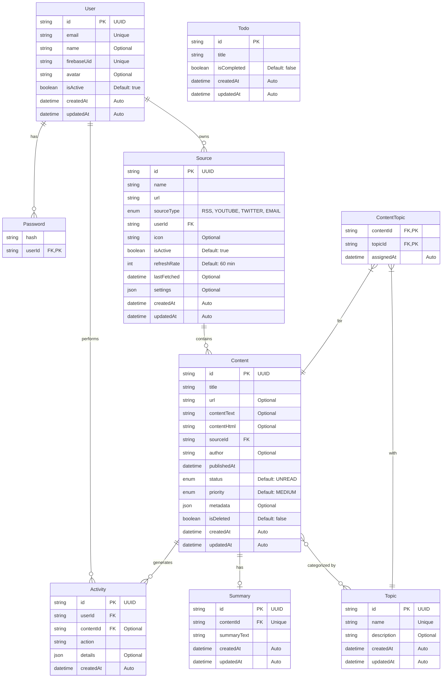

# Entity-Relationship Diagram (ERD)

This document contains the Entity-Relationship Diagram for the AI Feed Consolidator database schema.

## Database Schema Overview

The AI Feed Consolidator uses a PostgreSQL database with the following structure:

## Enum Types

### SourceType
- `RSS`: RSS and Atom feed sources
- `YOUTUBE`: YouTube platform sources (Watch Later, playlists)
- `TWITTER`: X/Twitter platform sources (bookmarks) 
- `EMAIL`: Email-based content sources

### ContentStatus
- `UNREAD`: Content that has not been viewed/read yet
- `READ`: Content that has been viewed/read  
- `ARCHIVED`: Content that has been archived for later reference
- `DELETED`: Content marked for deletion (soft delete)

### ContentPriority
- `LOW`: Low priority content
- `MEDIUM`: Medium priority content (default)
- `HIGH`: High priority content
- `URGENT`: Urgent content requiring immediate attention

## Key Relationships

- A **User** can have multiple **Sources**, but each Source belongs to one User
- A **Source** can have multiple **Content** items, but each Content item comes from one Source
- A **Content** item can have one **Summary**
- A **Content** item can be associated with multiple **Topics** through the **ContentTopic** junction table
- A **User** can have multiple **Activities**, and each Activity is performed by one User
- An **Activity** can be related to a **Content** item, but this relationship is optional

## Design Considerations

- UUIDs are used for primary keys to avoid exposure of sequential IDs
- All models include created/updated timestamps for auditing
- Full-text search is supported via PostgreSQL's capabilities
- JSON fields are used for flexible metadata storage
- Relationships are defined with appropriate cascade behaviors 